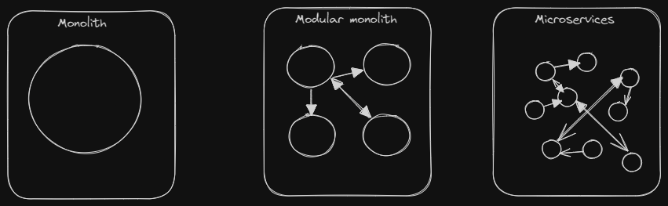

### Monoliths, Modular monoliths and Microservices

A **Monolithic** application is built as a single unified unit, tightly integrated, all components are developed and deployed together. **Modular monolithic** application divided into loosely coupled modules to improve maintainability and scalability. While a **Microservices** architecture is a collection of smaller, independently deployable services.

#### Reference

[1] [Microservices vs. monolithic architecture - Atlassian](https://www.atlassian.com/microservices/microservices-architecture/microservices-vs-monolith)

[2] [What’s the Difference Between Monolithic and Microservices Architecture?](https://aws.amazon.com/compare/the-difference-between-monolithic-and-microservices-architecture/)

[3] [Deconstructing the Monolith: Designing Software that Maximizes Developer Productivity](https://shopify.engineering/deconstructing-monolith-designing-software-maximizes-developer-productivity)

[4] [Under Deconstruction: The State of Shopify’s Monolith](https://shopify.engineering/shopify-monolith)

[5] [Adopting Microservices at Netflix: Lessons for Architectural Design](https://www.nginx.com/blog/microservices-at-netflix-architectural-best-practices/)

[6] [Martin Fowler - Microservices](https://martinfowler.com/articles/microservices.html)
