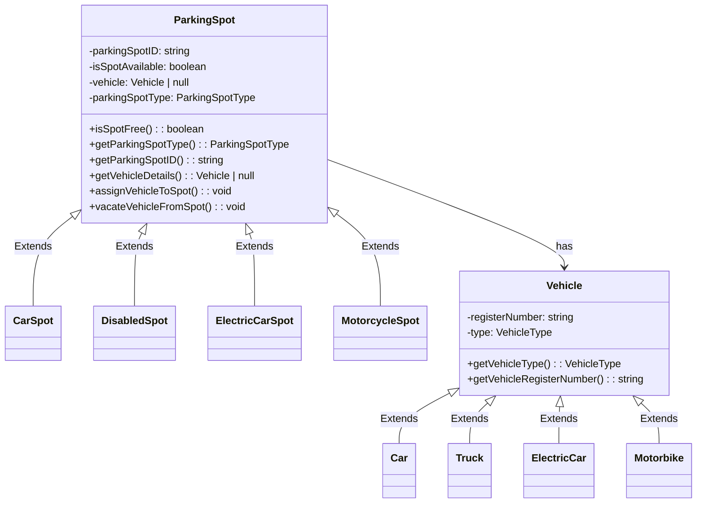
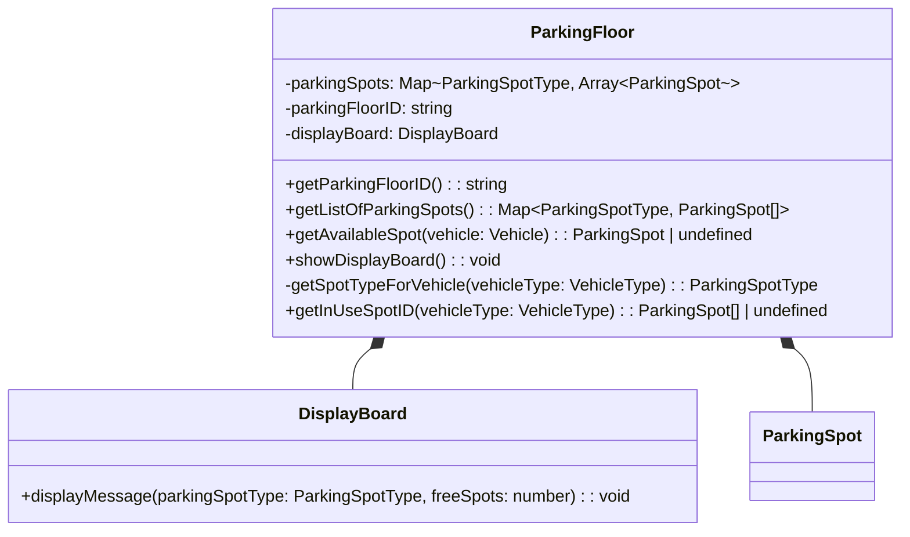
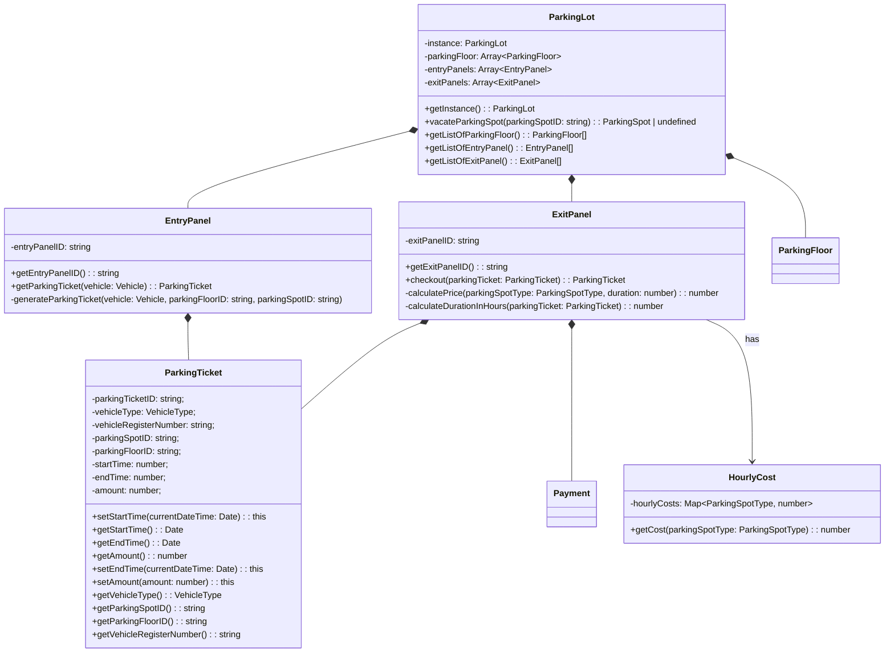

```mermaid
classDiagram
    class ParkingSpot {
        -parkingSpotID: string
        -isSpotAvailable: boolean
        -vehicle: Vehicle | null
        -parkingSpotType: ParkingSpotType
        +isSpotFree(): boolean
        +getParkingSpotType(): ParkingSpotType
        +getParkingSpotID(): string
        +getVehicleDetails(): Vehicle | null
        +assignVehicleToSpot(): void
        +vacateVehicleFromSpot(): void
    }
    ParkingSpot <|-- CarSpot: Extends
    ParkingSpot <|-- DisabledSpot: Extends
    ParkingSpot <|-- ElectricCarSpot: Extends
    ParkingSpot <|-- MotorcycleSpot: Extends
    class Vehicle {
        -registerNumber: string
        -type: VehicleType
        +getVehicleType(): VehicleType
        +getVehicleRegisterNumber(): string
    }
    Vehicle <|-- Car: Extends
    Vehicle <|-- Truck: Extends
    Vehicle <|-- ElectricCar: Extends
    Vehicle <|-- Motorbike: Extends
    ParkingSpot --> Vehicle: has
```

```mermaid
classDiagram
    class ParkingFloor {
        -parkingSpots: Map~ParkingSpotType, Array~ParkingSpot~~
        -parkingFloorID: string
        -displayBoard: DisplayBoard
        +getParkingFloorID(): string
        +getListOfParkingSpots(): Map~ParkingSpotType, ParkingSpot[]~
        +getAvailableSpot(vehicle: Vehicle): ParkingSpot | undefined
        +showDisplayBoard(): void
        -getSpotTypeForVehicle(vehicleType: VehicleType): ParkingSpotType
        +getInUseSpotID(vehicleType: VehicleType): ParkingSpot[] | undefined
    }
    class DisplayBoard {
        +displayMessage(parkingSpotType: ParkingSpotType, freeSpots: number): void
    }
    ParkingFloor *-- DisplayBoard
    ParkingFloor *-- ParkingSpot
```

```mermaid
classDiagram
    class ParkingLot {
        -instance: ParkingLot
        -parkingFloor: Array~ParkingFloor~
        -entryPanels: Array~EntryPanel~
        -exitPanels: Array~ExitPanel~
        +getInstance(): ParkingLot
        +vacateParkingSpot(parkingSpotID: string): ParkingSpot | undefined
        +getListOfParkingFloor(): ParkingFloor[]
        +getListOfEntryPanel(): EntryPanel[]
        +getListOfExitPanel(): ExitPanel[]
    }
    class EntryPanel {
        -entryPanelID: string
        +getEntryPanelID(): string
        +getParkingTicket(vehicle: Vehicle): ParkingTicket
        -generateParkingTicket(vehicle: Vehicle, parkingFloorID: string, parkingSpotID: string)
    }
    class ExitPanel {
        -exitPanelID: string
        +getExitPanelID(): string
        +checkout(parkingTicket: ParkingTicket): ParkingTicket
        -calculatePrice(parkingSpotType: ParkingSpotType, duration: number): number
        -calculateDurationInHours(parkingTicket: ParkingTicket): number
    }
    class ParkingTicket {
        -parkingTicketID: string;
        -vehicleType: VehicleType;
        -vehicleRegisterNumber: string;
        -parkingSpotID: string;
        -parkingFloorID: string;
        -startTime: number;
        -endTime: number;
        -amount: number;
        +setStartTime(currentDateTime: Date): this
        +getStartTime(): Date
        +getEndTime(): Date
        +getAmount(): number
        +setEndTime(currentDateTime: Date): this
        +setAmount(amount: number): this
        +getVehicleType(): VehicleType
        +getParkingSpotID(): string
        +getParkingFloorID(): string
        +getVehicleRegisterNumber(): string
    }
    class HourlyCost {
        -hourlyCosts: Map~ParkingSpotType, number~
        +getCost(parkingSpotType: ParkingSpotType): number
    }
    ParkingLot *-- EntryPanel
    ParkingLot *-- ExitPanel
    ParkingLot *-- ParkingFloor
    EntryPanel *-- ParkingTicket
    ExitPanel *-- ParkingTicket
    ExitPanel  *-- Payment
    ExitPanel --> HourlyCost: has
```
