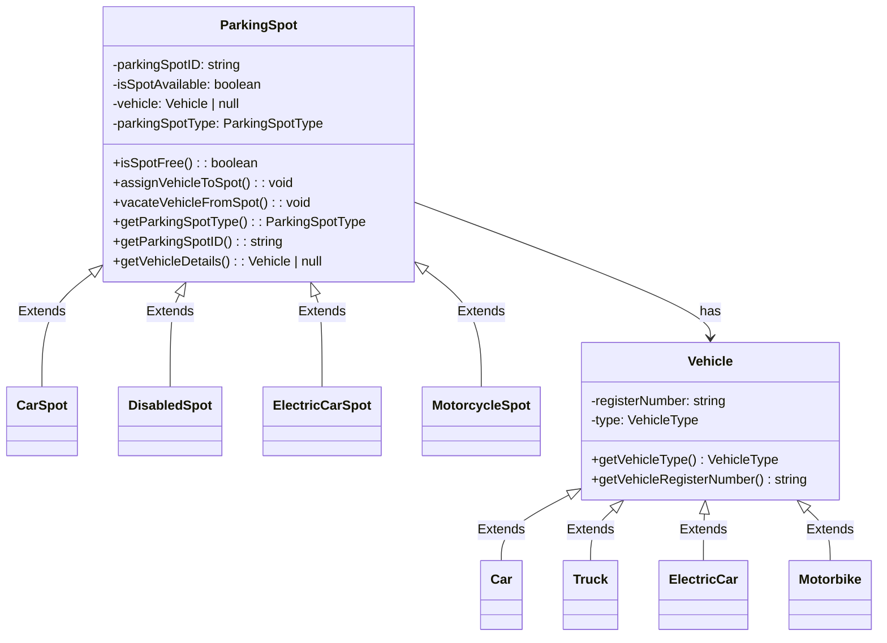
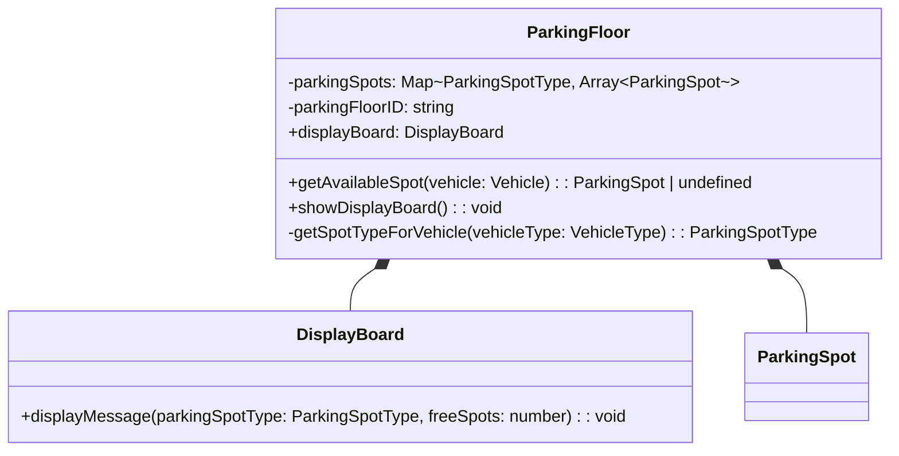
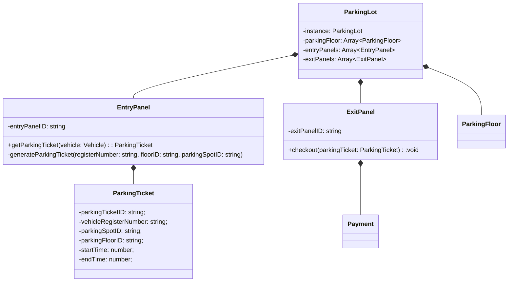

```mermaid
classDiagram
    class ParkingSpot {
        -parkingSpotID: string
        -isSpotAvailable: boolean
        -vehicle: Vehicle | null
        -parkingSpotType: ParkingSpotType
        +isSpotFree(): boolean
        +assignVehicleToSpot(): void
        +vacateVehicleFromSpot(): void
        +getParkingSpotType(): ParkingSpotType
        +getParkingSpotID(): string
        +getVehicleDetails(): Vehicle | null
    }
    ParkingSpot <|-- CarSpot: Extends
    ParkingSpot <|-- DisabledSpot: Extends
    ParkingSpot <|-- ElectricCarSpot: Extends
    ParkingSpot <|-- MotorcycleSpot: Extends
    class Vehicle {
        -registerNumber: string
        -type: VehicleType
        +getVehicleType() VehicleType
        +getVehicleRegisterNumber() string
    }
    Vehicle <|-- Car: Extends
    Vehicle <|-- Truck: Extends
    Vehicle <|-- ElectricCar: Extends
    Vehicle <|-- Motorbike: Extends
    ParkingSpot --> Vehicle: has
```

```mermaid
classDiagram
    class ParkingFloor {
        -parkingSpots: Map~ParkingSpotType, Array~ParkingSpot~~
        -parkingFloorID: string
        +displayBoard: DisplayBoard
        +getAvailableSpot(vehicle: Vehicle): ParkingSpot | undefined
        +showDisplayBoard(): void
        -getSpotTypeForVehicle(vehicleType: VehicleType): ParkingSpotType
    }
    class DisplayBoard {
        +displayMessage(parkingSpotType: ParkingSpotType, freeSpots: number): void
    }
    ParkingFloor *-- DisplayBoard
    ParkingFloor *-- ParkingSpot
```

```mermaid
classDiagram
    class ParkingLot {
        -instance: ParkingLot
        -parkingFloor: Array~ParkingFloor~
        -entryPanels: Array~EntryPanel~
        -exitPanels: Array~ExitPanel~
    }
    class EntryPanel {
        -entryPanelID: string
        +getParkingTicket(vehicle: Vehicle): ParkingTicket
        -generateParkingTicket(registerNumber: string, floorID: string, parkingSpotID: string)
    }
    class ExitPanel {
        -exitPanelID: string
        +checkout(parkingTicket: ParkingTicket):void
    }
    class ParkingTicket {
        -parkingTicketID: string;
        -vehicleRegisterNumber: string;
        -parkingSpotID: string;
        -parkingFloorID: string;
        -startTime: number;
        -endTime: number;
    }
    class Payment {

    }
    ParkingLot *-- EntryPanel
    ParkingLot *-- ExitPanel
    ParkingLot *-- ParkingFloor
    EntryPanel *-- ParkingTicket
    ExitPanel  *-- Payment
```
