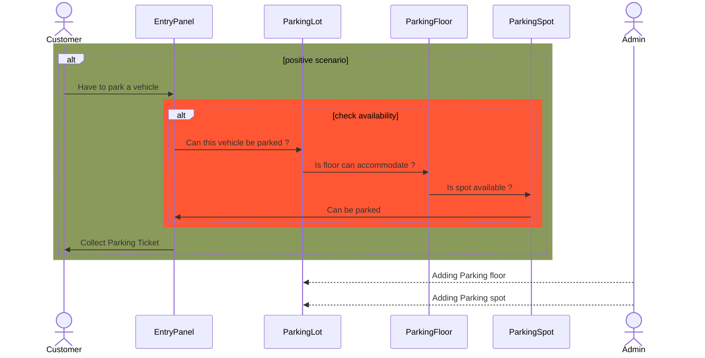

```mermaid
sequenceDiagram
    actor Customer
    rect rgb(138, 154, 91)
    alt positive scenario
    Customer->>EntryPanel: Have to park a vehicle
    rect rgb(255, 87, 51)
    alt check availability
    EntryPanel->>ParkingLot: Can this vehicle be parked ?
    ParkingLot->>ParkingFloor: Is floor can accommodate ?
    ParkingFloor->>ParkingSpot: Is spot available ?
    ParkingSpot->>EntryPanel: Can be parked
    end
    end
    EntryPanel->>Customer: Collect Parking Ticket
    end
    end
    actor Admin
    Admin-->>ParkingLot: Adding Parking floor
    Admin-->>ParkingLot: Adding Parking spot
```
